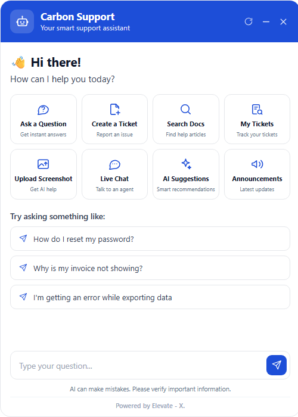
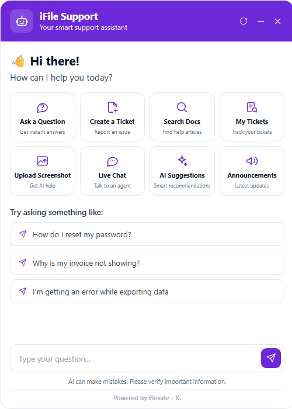

# IRIS — Intelligent Support Ticketing Platform

**A standalone, multi-product support ticketing platform that any product plugs into with one `<script>` tag.**

The platform owns the ticketing data, the workflow, the analytics and the audit trail. Products integrate through a versioned REST contract and an embeddable widget — they never own a ticket, never build a support UI, and never redeploy to change how support behaves in their app.

> IRIS-HACK-P-2026-002 · Built for the IRIS hackathon.
> **Status:** widget, gateway, core-service and the **multi-tenant admin portal** are built, tested and running, including the full just-in-time access-grant cycle. `ai-service`, `notification-service` and `worker` are specified but not built — see [Roadmap](#roadmap).

| | |
|---|---|
| **Run it** | [Quick start](#quick-start) — 7 commands, ~2 minutes |
| **Sign in** | `http://localhost:4000/admin` — `admin@irisregtech.com` / `Abc@1234` |
| **Integrate it** | [widget/INTEGRATION.md](widget/INTEGRATION.md) — one script tag |
| **Understand it** | [docs/HLD.md](docs/HLD.md) · [docs/schema.md](docs/schema.md) · [docs/adr/](docs/adr/) — 11 decision records |
| **Call it** | [docs/api-contract.md](docs/api-contract.md) — with verifiable HMAC test vectors |

---

## The problem

IRIS runs multiple products, and every one of them needs support ticketing. Today it is non-existent, glued together with email, or rebuilt per product. Each implementation reinvents the same flow — raise, classify, route, assign, resolve, rate — and none of them share data, so a customer with tickets in two products has two unrelated histories and nobody has a single view of SLAs.

Building this as a *platform* is harder than building it as a feature, but the architecture is far more valuable. The interesting problems are not the ticket CRUD. They sit at the integration boundary:

- **How does a product raise a ticket without owning the ticket data?**
- **How does an engineer get scoped, time-bounded access back into that product to investigate — without the platform owning that product's permission model?**
- **How does identity flow across the boundary without a second login?**

Those three questions are where the design effort went.

---

## What it does

<table>
<tr><td width="50%" valign="top">

**For end users** — an embeddable assistant that answers questions from the knowledge base before a ticket is ever filed, raises tickets with attachments, and tracks them. Branded per product, configured server-side.

</td><td width="50%" valign="top">

**For the support team** — one queue across every product, with per-product SLAs, a compliance-grade audit trail, and zero standing access to customer data.

</td></tr>
<tr><td valign="top">

**For integrating products** — a versioned REST contract, signed webhooks on every state change, and SSO that carries the user's identity in without re-authentication.

</td><td valign="top">

**For the platform team** — one deployment serving many products, with tenant isolation enforced by the database rather than by application `if` statements.

</td></tr>
</table>

### The widget

<p align="center">
  
  &nbsp;&nbsp;
  
</p>

<p align="center"><sub><b>The same bundle, two tenants.</b> Nothing but server-side config differs — no code change, no redeploy.</sub></p>

Eight capabilities, all working:

| | | | |
|---|---|---|---|
| **Ask a Question** — answers from the KB and past resolved tickets | **Create a Ticket** — category, severity, attachments | **Search Docs** — knowledge base search | **My Tickets** — their own only, enforced in the database |
| **Upload Screenshot** | **Live Chat** — converts to a ticket ([ADR-011](docs/adr/011-live-chat-deferred.md)) | **AI Suggestions** — relevant fixes before submitting | **Announcements** |

---

## Architecture

```
   INTEGRATING PRODUCT (Carbon / iFile / …)
   ┌────────────────────────────────────────────────────────┐
   │  <script src=".../widget.js">   ·  backend REST (SDK)  │
   │  webhook receiver               ·  JWKS endpoint       │
   └───────────────┬────────────────────────────────────────┘
                   │  HTTPS · /v1/* · HMAC-SHA256 + product-signed JWT
      ═════════════▼═════════════ public boundary ═════════════
   ┌───────────────────────────┐
   │ gateway            :4000  │  HMAC verify · JWKS verify · rate limit
   │ (Node · Fastify)          │  idempotency · request-id · error envelope
   └───────────────┬───────────┘  NO business logic
                   │ internal only
   ┌───────────────▼────────────────────────────────────────┐
   │ core-service       :4100         ★ sole DB credential   │
   │  tickets · knowledge-base · widget · products           │
   │  audit (append-only) · events (outbox) · storage        │
   └───────────────┬────────────────────────────────────────┘
                   │ SQL, always inside an RLS-scoped transaction
   ┌───────────────▼────────────────────────────────────────┐
   │ PostgreSQL 17 + pgvector  :5432   ·   Redis  :6380      │
   └────────────────────────────────────────────────────────┘

   admin-panel (React SPA) is served by the gateway at /admin — same-origin,
   so the support session lives in an httpOnly cookie rather than localStorage.

   not built yet:  ai-service :5000 · worker · notification-service :5100
```

### Services

| Service | Owns | Explicitly does **not** |
|---|---|---|
| **gateway** | HMAC verification, JWT/JWKS verification, per-product rate limiting, idempotency, request-id, error envelope. Serves `widget.js` | Business rules, database access, knowing what a ticket is |
| **core-service** | Ticket state machine, knowledge base, per-product config, audit writes, outbox, attachments, **all SQL** | Sending anything outbound, AI inference |
| **widget** | The embeddable UI, iframe-isolated | Holding any secret |
| **admin-panel** | The support team UI — 6 pages, served at /admin | Talking to core-service directly; it goes through the gateway |
| **shared** | HMAC utilities, DTOs, the brand constant | Business logic |

### The four invariants

Not style preferences — breaking any one breaks a security guarantee. Enforced in code, documented in [SKILLS.md](SKILLS.md).

| # | Invariant | Why |
|---|---|---|
| 1 | **Exactly one process holds a database credential** — core-service | Every isolation guarantee runs through RLS, applied per-session by core-service. A second connection is a second, unpoliced path to the data |
| 2 | **No unscoped read** — all SQL goes through `withScope()` | If a query forgets a `product_id` predicate, RLS makes the failure *"zero rows"*, never *"another product's rows"* |
| 3 | **The gateway knows about credentials, never about tickets** | "core-service is unreachable from outside" is a security boundary only while the gateway is a boundary |
| 4 | **AI is suggestive, never autonomous** | Deflection (user gets an answer, never files) is allowed. Auto-resolution (AI closes an open ticket) is not — [ADR-009](docs/adr/009-deflection-is-not-auto-resolution.md) |

---

## The two-layer tenancy model

Conflating these two layers is the pitfall the brief calls out by name.

```
Platform (IRIS Ticketing)
 └── Product tenant            ← an integrating product: Carbon, iFile …
      └── Customer tenant       ← that product's own customer company
           └── End user          ← the human who raises a ticket
```

| Layer | Identity owned by | Stored as | Isolation |
|---|---|---|---|
| **Product** | The platform | `product_id` | **Primary security boundary**, enforced by Postgres RLS |
| **Customer** | The integrating product | `product_tenant_id` (opaque string) | Filtering, analytics, access scoping |
| **End user** | The integrating product | `raised_by_ref` (opaque `sub`) + a cached identity snapshot | Never a platform account |

---

## Integration tiers

Each is additive and self-contained. Adopting a higher tier never means rewriting the lower one.

| Tier | The product writes | Gets | Effort |
|---|---|---|---|
| **Zero-code** | One `<script>` tag | Raise tickets, ask questions, search docs, track tickets — branded, configured server-side | ~5 min |
| **Low-code** | + a webhook URL and short-lived identity JWTs | Everything above, plus SSO with no second login and state-change events | ~1 hour |
| **Full-code** | + backend REST with HMAC signing | Everything above, plus programmatic control | ~1 day |

**The zero-code tier is genuinely code-free** because fields, categories, severities, branding, suggested questions and which tiles appear all live in server-side config. A product changes its widget by editing config — **no redeploy on their side**.

Full guide: [widget/INTEGRATION.md](widget/INTEGRATION.md).

---

## Security model

The parts that are load-bearing, and that the test suite proves.

### Isolation is enforced by the database

Postgres Row-Level Security on `product_id`, plus application-layer checks — defence in depth ([ADR-004](docs/adr/004-isolation-row-level-security.md)). The realistic threat is not a malicious insider; it is **a developer forgetting a `WHERE product_id = $1` at 2am**. RLS makes that failure mode *zero rows*.

Two ways to configure RLS into silently doing nothing, both guarded against:

- **Table owners bypass RLS** unless forced. Every table is `ENABLE` **and** `FORCE ROW LEVEL SECURITY`, and the app connects as a **non-owner** role. core-service **refuses to boot** if it detects a `SUPERUSER`/`BYPASSRLS` connection.
- **Pooled connections leak session state.** Only `SET LOCAL` inside a transaction — a plain `SET` persists for the life of a pooled connection and leaks one request's scope into the next.

### The audit trail cannot be rewritten

`UPDATE` and `DELETE` on `audit_event` are **revoked from the application role at the database**. A fully compromised application still cannot rewrite history. Verified: attempting a delete as the app role returns `permission denied`.

### Other properties

| Property | How |
|---|---|
| A publishable key leak is a nuisance, not a breach | Permits only 4 operations, scoped to the bearer's identity, origin-allowlisted, tightly rate-limited |
| A user can only see their own tickets | RLS predicate on `raised_by_ref`, not an application check |
| Cross-product reads return **404, not 403** | A 403 would confirm the resource exists |
| Replay is closed | ±300s timestamp window, nonce cache, and method+path bound *inside* the signature |
| Identity tokens are short-lived | `exp − iat ≤ 300s`, asymmetric algorithms only (explicit `RS256`/`ES256` allowlist — `alg: none` and HS256-confusion are the two classic JWT breaks) |
| Attachments can't become stored XSS | SVG/HTML blocked on upload; served from a separate origin, `Content-Disposition: attachment`, never inline |
| A ticket resolve can never lose its side effects | Transactional outbox — the state change, the audit row and the event commit together or not at all |

---

## Tech stack

| Layer | Choice | Why |
|---|---|---|
| Gateway, core-service | **Node 22 · TypeScript · Fastify** | High-concurrency I/O; one language across the boundary |
| Database | **PostgreSQL 17 + pgvector** | RLS *is* the isolation model. pgvector avoids a separate vector store |
| Search (today) | **Postgres full-text** (`tsvector` + trigram) | Real answers with no AI service. Swaps to hybrid semantic ranking behind the same endpoints |
| Queue | **Redis** | Rate limiting now; BullMQ jobs when `worker` lands |
| Widget | **Vanilla TS + Vite, no framework** | It loads on every page of every integrating product — bundle size is a feature. Loader is **4.5 kB** (1.9 kB gzipped) |
| AI (planned) | **Python · FastAPI** | Better ecosystem for embeddings and classification — [ADR-007](docs/adr/007-polyglot-topology-one-db-credential.md) |
| Containers | **Podman** | What is installed here. Compose file is compatible |

---

## Quick start

> Every command below has been executed and verified from a wiped database. If one fails, that is a bug.

### Prerequisites

| | Version | Notes |
|---|---|---|
| **Node.js** | ≥ 22 | Uses `process.loadEnvFile` — 22+ required, not just preferred |
| **Podman** | 5.x + `podman-compose` | **Not Docker.** The Docker CLI is absent on this machine |
| Disk | ~1 GB | Node modules + the Postgres image |

> **The native Windows PostgreSQL 18 on port 5433 is never touched.** This project runs its own container on 5432. Both coexist — see [docs/port-mapping.md](docs/port-mapping.md).

### Seven commands

```bash
npm install                   # 1. dependencies
npm run infra:up              # 2. Postgres+pgvector :5432, Redis :6380
cp .env.example .env          # 3. Windows: copy .env.example .env
npm run migrate               # 4. 6 migrations
npm run seed                  # 5. 2 products, 15 KB articles, 40 tickets
npm run build                 # 6. widget bundle
npm run dev                   # 7. core + gateway + test page
```

Wait for `(healthy)` on both containers (`podman ps`) before step 4.

```
[demo]    test page  http://localhost:3100
[core]    core-service listening (internal only)  port: 4100
[gateway] gateway listening (public)              port: 4000
```

### 👉 Open **http://localhost:3100** and click the blue bubble, bottom-right

**Click "Sign in as Siddhesh" first.** The greeting changes from *"Hi there!"* to *"Hi Siddhesh!"* and My Tickets fills up — that is the SSO handoff working. Without it you are browsing anonymously.

---

## Running it manually

`npm run dev` wraps these. Run them separately for per-service logs, or to restart one service alone. **Start core-service before the gateway** — the gateway proxies to it.

```bash
# Terminal 1 — core-service (internal, :4100)
npm run dev:core

# Terminal 2 — gateway (public, :4000, also serves widget.js)
npm run dev:gateway

# Terminal 3 — the test page (:3100)
node -e "const{createServer}=require('http'),{readFileSync}=require('fs'),p=require('path');const R=p.join(process.cwd(),'widget','demo');createServer((q,s)=>{try{s.writeHead(200,{'Content-Type':'text/html'});s.end(readFileSync(p.join(R,q.url==='/'?'index.html':q.url)))}catch{s.writeHead(404).end()}}).listen(3100,()=>console.log('http://localhost:3100'))"
```

## Day to day

| Command | Does |
|---|---|
| `npm run dev` | Start core + gateway + test page |
| `npm run infra:up` / `infra:down` | Start / stop containers (data survives `down`) |
| `npm run infra:reset` | **Wipes the database volume.** Follow with `migrate` + `seed` |
| `npm run seed` | Re-seed. Idempotent |
| `npm run build` | Rebuild the widget bundle |
| `npm test` | Unit tests — 50 TypeScript + 25 Python |
| `npm run test:e2e` | Live suites — 43 widget + 52 admin + 9 contract. **Needs the stack running** |
| `npm run test:contract` | Live responses vs the published OpenAPI spec |
| `npm run typecheck` | TypeScript across every workspace |

**After changing widget code, run `npm run build`** — the gateway serves the built bundle from `widget/dist`, so source edits alone will not appear. Backend code hot-reloads via `tsx watch`.

## What runs where

| Service | Port | Exposed | Notes |
|---|---|---|---|
| gateway | **4000** | ✅ Public | The only API surface. Also serves `widget.js` |
| core-service | 4100 | ❌ `127.0.0.1` | Holds the **only** database credential |
| test page | 3100 | ✅ Local | Separate origin, so the widget is exercised cross-origin like a real product |
| Postgres + pgvector | 5432 | ❌ `127.0.0.1` | Container `iris-postgres` |
| Redis | **6380** | ❌ `127.0.0.1` | Not 6379 — that belongs to an unrelated container here |

---

## Verifying it works

```bash
npm test                 # 50 TypeScript + 25 Python — HMAC vectors, state machine, contract
npm run test:e2e         # 104 passed — widget, admin portal, contract conformance
npm run typecheck        # clean
```

`npm test` includes the **published HMAC test vectors** — the same values in [docs/api-contract.md §3.3](docs/api-contract.md) that integrators check their signing code against. If those fail, we have broken every integrator. The Python suite signs the same vectors with [`shared/hmac-utils/py`](shared/hmac-utils/py/), proving both implementations agree byte for byte.

`npm run test:e2e` proves, against a live database:

- An iFile key requesting a Carbon ticket gets **404, not 403**
- One user cannot see another user's tickets
- A raiser cannot mark their own ticket resolved
- core-service refuses direct calls that bypass the gateway
- Unknown and missing credentials are rejected; rate limiting holds

## The admin portal

**http://localhost:4000/admin**

Six pages: Dashboard, Tickets, Ticket Detail, Agents, Tenants, Audit Logs.

### Sign in

| Account | Password | Role | Tenant access |
|---|---|---|---|
| **admin@irisregtech.com** | `Abc@1234` | Super Admin | **All four tenants.** Onboards tenants, manages every user |
| ops.manager@irisregtech.com | `Abc@1234` | Manager | **Carbon + ESG** — multi-tenant scoping, visible |
| carbon.agent@irisregtech.com | `Abc@1234` | Agent | Carbon only |
| esg.agent@ · ifile.agent@ · ideal.agent@ | `Abc@1234` | Agent | One tenant each |
| carbon.admin@ · esg.admin@ · ifile.admin@ · ideal.admin@ | `Abc@1234` | Tenant Admin | One tenant each |

### Three things worth doing

**1. See tenant isolation.** Sign in as `carbon.agent@` — only Carbon tickets exist as far as that session is concerned. Ask for an iFile ticket by id and you get **404, not 403**: a 403 would confirm the ticket exists.

**2. See zero standing access.** Open an unassigned ticket as an agent — you get the queue metadata but no comments, attachments or customer PII, with an explanation of why. Assign it to yourself and the payload appears. That gate is a **row-level security policy**, not a UI check.

**3. Watch the access cycle end to end.** Start the mock integrating product:

```bash
npm run mock-product          # http://localhost:6001
```

Assign a **Carbon** or **iFile** ticket (both use the callback mechanism). The mock verifies our HMAC signature and records the grant. Resolve the ticket and it revokes. Ticket Detail shows both grant layers with **the product's actual response bodies and latencies**.

To see the failure path — a dead-lettered revoke is a security incident, and the portal treats it as one:

```bash
curl -X POST "http://localhost:6001/fail-mode?on=true"
```

## Demo tenants

| Tenant | Publishable key | Colour | Access mechanism |
|---|---|---|---|
| **Carbon** | `pub_live_carbon_8f2a` | Blue | Server callback |
| **ESG** | `pub_live_esg_5b1c` | Green | Pre-authorised link |
| **iFile** | `pub_live_ifile_3c7b` | Purple | Server callback |
| **iDeal** | `pub_live_ideal_6d9e` | Amber | Pre-authorised link |

All four share a **generic category set** deliberately — branding and access mechanism are what differ, which is what proves one bundle serves many products. Swap the key to watch it happen:

```
http://localhost:4000/app/index.html?key=pub_live_ifile_3c7b
```

Deep link to a view with `&view=` — `ask`, `create`, `docs`, `tickets`, `announcements`.

## Troubleshooting

| Symptom | Cause | Fix |
|---|---|---|
| `EADDRINUSE` on 3100/4000/4100 | A previous run's processes are still alive | `netstat -ano \| findstr :4000` then `taskkill /PID <pid> /T /F`, or `DEMO_PORT=3200 npm run dev` |
| No blue bubble on the test page | Widget not built | `npm run build`, then hard-refresh (Ctrl+Shift+R) |
| `widget.js` 404s | `widget/dist` doesn't exist yet | `npm run build` |
| Migrate/seed `ECONNREFUSED :5432` | Containers not up or not yet healthy | `npm run infra:up`, wait for `(healthy)` |
| `invalid environment` at boot | `.env` missing | `cp .env.example .env` |
| Gateway starts, every request 401s | core-service not running | Start it first |
| `test:security` can't connect | Stack not running | It tests over HTTP — `npm run dev` first |
| Everything 500s after a schema change | Stale data | `npm run infra:reset && npm run migrate && npm run seed` |
| core-service refuses to boot, mentions RLS | Connected as a superuser/owner role | Use `iris_app`. This check is deliberate — see [ADR-004](docs/adr/004-isolation-row-level-security.md) |

---

## Project layout

| Path | What | Guide |
|---|---|---|
| [widget/](widget/) | The embeddable assistant — loader + iframe app | [SKILLS](widget/SKILLS.md) · [**INTEGRATION**](widget/INTEGRATION.md) |
| [gateway/](gateway/) | Auth, rate limiting, proxy. No business logic | [SKILLS](gateway/SKILLS.md) |
| [core-service/](core-service/) | Tickets, knowledge base, audit. Sole DB credential | [SKILLS](core-service/SKILLS.md) |
| [shared/](shared/) | HMAC utils (TS **and** Python), types, the OpenAPI contract | [SKILLS](shared/SKILLS.md) · [**contracts**](shared/contracts/README.md) |
| [infra/](infra/) | Compose file, migrations, seed | [SKILLS](infra/SKILLS.md) |
| [admin-panel/](admin-panel/) | Support portal — 6 pages, multi-tenant | [SKILLS](admin-panel/SKILLS.md) |
| [ai-service/](ai-service/) | **Spec only — not built** | [SKILLS](ai-service/SKILLS.md) · [**TODO**](ai-service/TODO.md) |
| [docs/](docs/) | HLD, API contract, schema, 11 ADRs | [HLD](docs/HLD.md) · [**Schema**](docs/schema.md) · [API](docs/api-contract.md) · [ADRs](docs/adr/) |

**Start here if you're writing code:** [SKILLS.md](SKILLS.md) — conventions, the four invariants, and the definition of done.

## Design decisions

Every significant decision is an ADR recording what was chosen, **what was rejected, and why**.

| ADR | Decision |
|---|---|
| [001](docs/adr/001-integration-contract-rest-webhooks.md) | Integration contract — REST + webhooks (GraphQL, signed event bus rejected) |
| [002](docs/adr/002-callback-security-hmac.md) | Callback security — HMAC-SHA256 (mTLS considered) |
| [003](docs/adr/003-sso-signed-jwt-handoff.md) | SSO — signed JWT handoff (OIDC optional, SAML rejected) |
| [004](docs/adr/004-isolation-row-level-security.md) | Isolation — Row-Level Security (schema/DB-per-tenant rejected) |
| [005](docs/adr/005-ai-confidence-thresholds.md) | AI confidence — margin-aware routing, not top-1 alone |
| [006](docs/adr/006-tat-definitions-and-clock-pauses.md) | TAT — two clocks, deliberately different |
| [007](docs/adr/007-polyglot-topology-one-db-credential.md) | Polyglot topology + the one-DB-credential invariant |
| [008](docs/adr/008-dual-access-mechanism.md) | Dual access — callback **and** client-minted pre-auth link |
| [009](docs/adr/009-deflection-is-not-auto-resolution.md) | Deflection is not auto-resolution |
| [010](docs/adr/010-automations-fixed-catalogue.md) | Automations — a fixed catalogue, not a rule engine |
| [011](docs/adr/011-live-chat-deferred.md) | Live Chat deferred — the stub converts to a ticket |

The sharpest one is [008](docs/adr/008-dual-access-mechanism.md). Support access into a product can be granted two ways, and the second is the interesting one: **the product mints an inert capability, and the platform can only bind and time-box it.** The platform never holds the product's signing key — so **even a fully compromised platform cannot fabricate access into that product.** A signed-callback design cannot make that claim.

## Roadmap

| Built | Specified, not built |
|---|---|
| ✅ Widget — all 8 capabilities | ⬜ `ai-service` — classification, embeddings, assignee scoring ([TODO](ai-service/TODO.md)) |
| ✅ Gateway — HMAC, JWKS, rate limiting, idempotency | ⬜ AI Insights / Analytics / Automations pages |
| ✅ core-service — tickets, KB, config, audit, outbox | ⬜ `notification-service` — email, WhatsApp, Slack, webhook delivery |
| ✅ RLS isolation, verified by test | ⬜ `worker` — BullMQ consumers |
| ✅ SSO identity handoff | ⬜ Webhook delivery to products |
| ✅ Knowledge base + deflection | ⬜ Sample integration products |
| ✅ **Multi-tenant admin portal** — 6 pages | |
| ✅ **JIT access grants** — T1 RLS + T2 product callbacks | |

The widget works fully without any of the right-hand column. Search and answers use Postgres full-text ranking today and swap to semantic ranking **behind the same endpoints** when `ai-service` lands — no client change, no migration (the `vector(384)` columns already exist).

---

<div align="center"><sub>Powered by Elevate - X.</sub></div>
